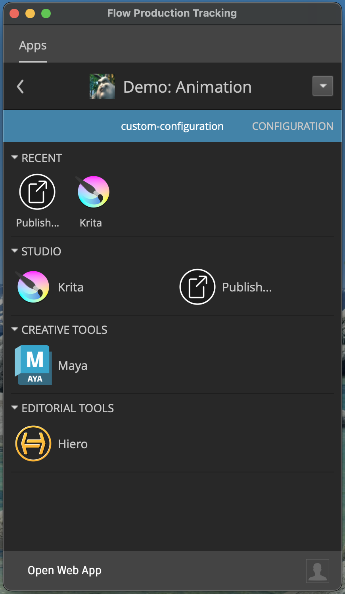

# Devlog

## Adding a new app
I first decided to add the Krita app to the configuration. I have done a lot of experiementing already, so I know how to add this app quite quickly.

1. Open 'Create' app
2. Setup the project configuration, I chose distributed setup and started with the "Flow Production Tracking Default" configuration
3. Create a new config sandbox (which puts us at the first commit for this project)
4. Follow the intructions in the [tk-krita repo](https://github.com/diegogarciahuerta/tk-krita)
    * Copy the keys and paths for krita into `template.yml`
    * Add the krita settings file `tk-krita.yml` to `./env/includes/settings/`
    * Update the relevant `tk-multi-*.yml` files, to include functionality from tk-krita in these apps
    * Update the `engine_locations.yml` file, to tell shotgrid where to find tk-krita
    * Update the relevant environment configurations `./env/`, to tell shotgrid when to show Krita as an option
5. Add Krita to the software in Shotgrid
6. I also had to update the tk-krita version to the latest version

---

After making these changes I loaded up Shotgun to see if it worked and it did!

But unfortunately, trying to launch the app failed. After a bit of investigation I realised that the most recent release of tk-krita was using reduce from python2 rather than python3 where it needs to be imported first. I created a  and fixed this and now Krita launched from Shotgun.

---

_It became obvious doing this exercise that adding an app could easily be automated with a simple script. This would allow non-standard functionality to still be controlled and setup to the needs of the organisation without having to manually build these configurations for every user / project._

---
